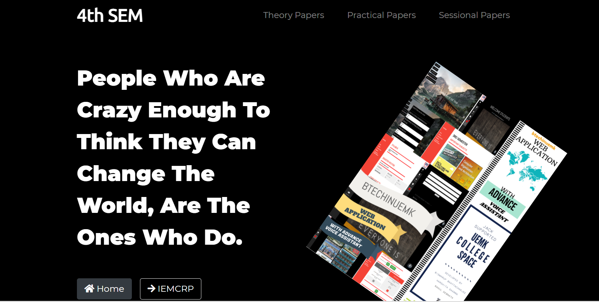
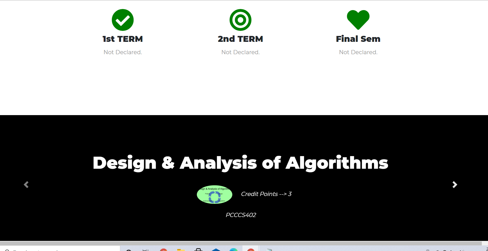
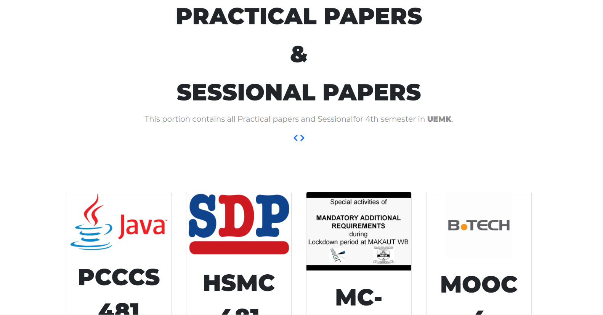
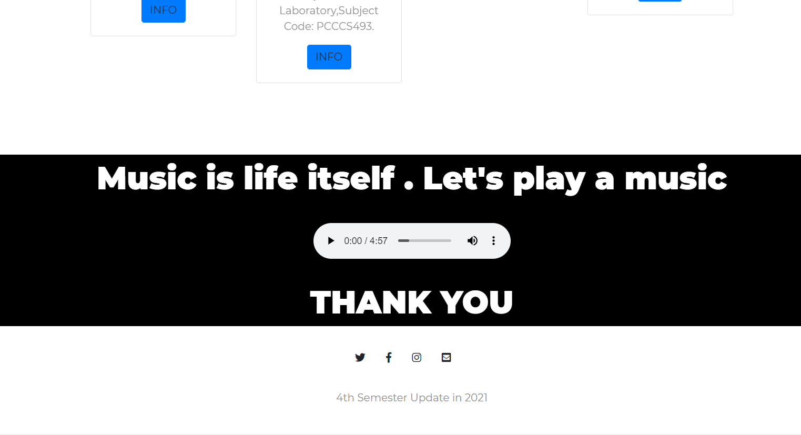

# 4TH-SEM-WEBPAGE-UI-DESIGN :star_struck: :sunglasses: :computer: :open_file_folder:

[](https://shields.io/) [](https://shields.io/) 

***This new Web page is created by Biswarup Bhattacharjee, student of BTECH, in University of Engineering and Management, Kolkata.***

**Email Id: bbiswa471@gmail.com.** 

**Contact No: 916290272740.** 


<p align="left">
<a href="https://facebook.com/biswarup.bhattacharjee.5811" target="blank"></a>
<a href="https://instagram.com/biswarup2210" target="blank"></a>
<a href="https://github.com/biswa2210/biswa2210" target="blank"></a>
</p>

## About :point_down: 

This is a UI design of a web page of a website. It is a part of my website. It contains all subjects of 4 th semester in 2 nd year. It contains 1st term, 2nd term, 3rd term area. Basically it shows the design of a web page in this website.

## LINK : :point_right: https://biswa2210.github.io/4th-sem-UI-design/

## LINK OF FULL WEBSITE: :point_right: https://uemk-btech-cs.000webhostapp.com/

## Purpose :point_down:

I have made to make my web page user friendly and to give a compact look.

## Importance :point_down:

It is important to set a user friendly user interface in a website.

## Folder Structure :point_down:

```bash
4th-sem-UI
    ├── bgmusic
    ├── css
    |    └── style.css
    ├── images
    └── index.html
```
## Making :point_down:

I have created this using HTML5 and CSS3. It is fully responsive.

## Screenshots :point_down: 

<div align="center">
<a href="ui1.PNG"></a> <a href="ui2.PNG"></a>
    
<a href="ui3.PNG"></a> <a href="ui4.PNG"></a>
</div>
